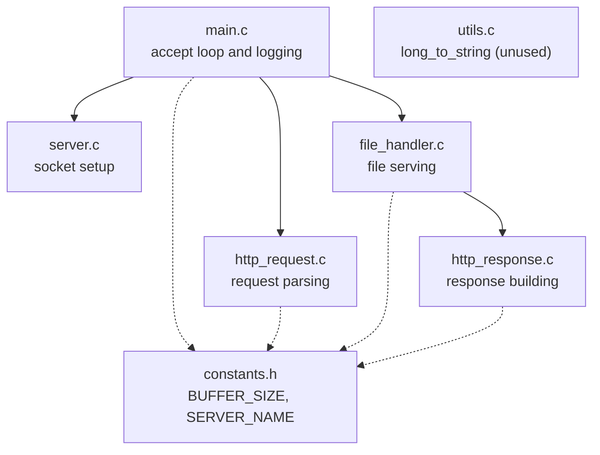
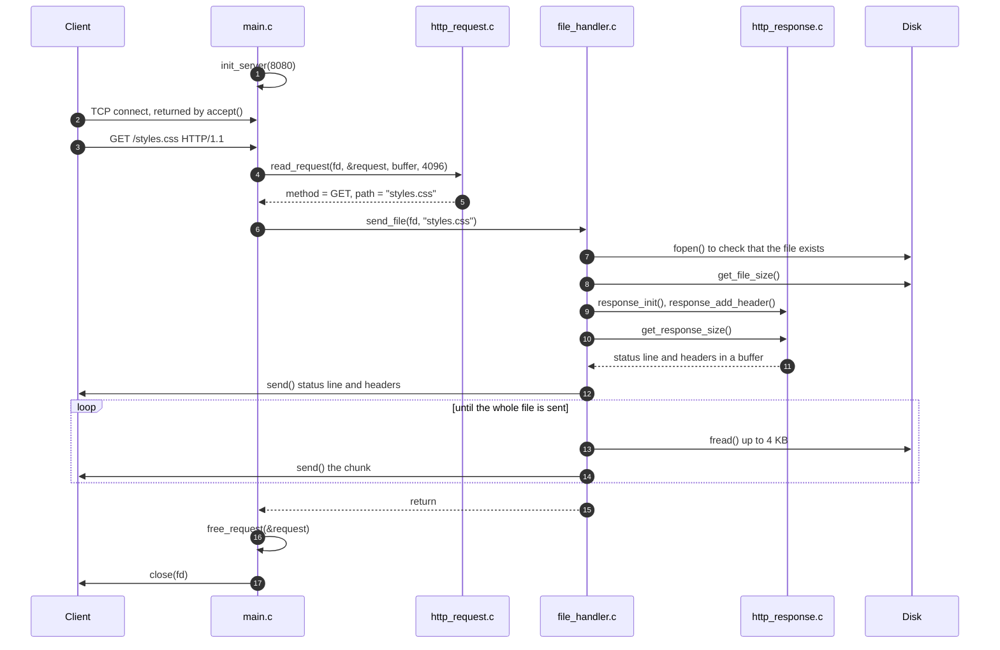
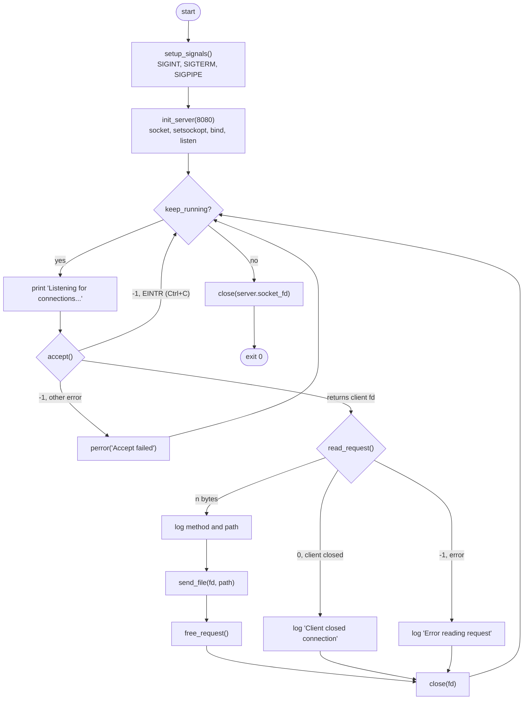
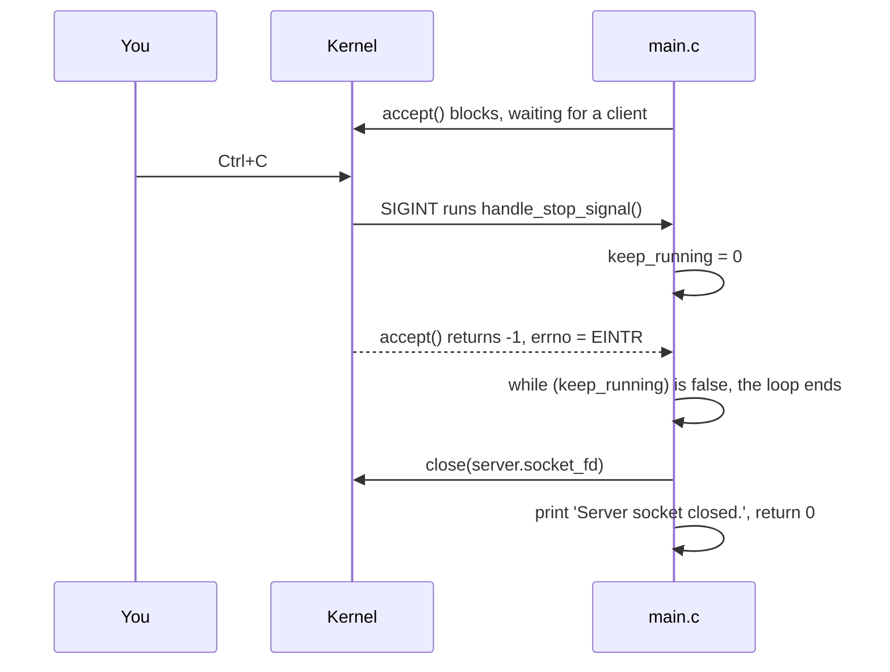
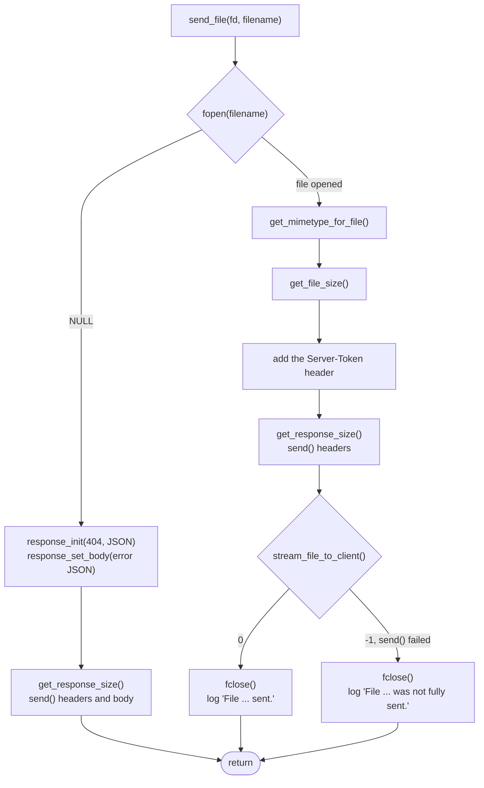
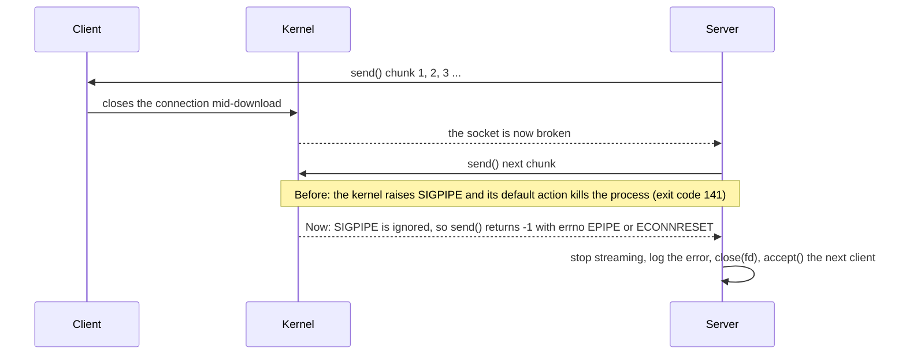

# Nano Server C: Technical Documentation

This document explains how Nano Server C works on the inside: how a request moves through the code, what each module does, what the data structures look like and how to extend the server. For a short overview, build instructions and the list of supported HTTP features, see the [README](README.md).

The diagrams use [Mermaid](https://mermaid.js.org/), which GitHub renders automatically. To see them in the VS Code preview, install the *Markdown Preview Mermaid Support* extension.

All console output, traces and byte counts in this document come from running the code in this repository. Code marked as a **suggested change** is not in the repository yet.

## Contents

1. [Architecture](#1-architecture)
2. [Request lifecycle](#2-request-lifecycle)
3. [Socket setup: `server.c`](#3-socket-setup-serverc)
4. [Request parsing: `http_request.c`](#4-request-parsing-http_requestc)
5. [Response building: `http_response.c`](#5-response-building-http_responsec)
6. [File serving: `file_handler.c`](#6-file-serving-file_handlerc)
7. [Constants, utilities and memory](#7-constants-utilities-and-memory)
8. [Error handling](#8-error-handling)
9. [Build system](#9-build-system)
10. [Inspecting and debugging the server](#10-inspecting-and-debugging-the-server)
11. [Extending the server](#11-extending-the-server)
12. [Known issues](#12-known-issues)

---

## 1. Architecture

### Design at a glance

| Aspect | Design |
| --- | --- |
| Concurrency | One process, one thread, blocking I/O. Clients are served one after another. This is called an *iterative* server. |
| Connections | One request per connection. The server closes the socket after every response. |
| Content | Static files only, read from the server's current working directory. |
| Request handling | Every request is treated as a file download, whatever its method. |
| Dependencies | The C standard library and POSIX sockets. Nothing else. |

### Modules



Solid arrows are function calls. Dotted arrows mean that the module includes `constants.h`. No module calls `utils.c` yet.

| Source | Header | Responsibility |
| --- | --- | --- |
| [src/main.c](src/main.c) | none | Entry point. Sets up signal handling, starts the server, runs the accept loop, logs each request, calls `send_file()` and shuts down cleanly on `Ctrl+C`. |
| [src/server.c](src/server.c) | [include/server.h](include/server.h) | Creates the TCP socket, binds it to a port and starts listening. |
| [src/http_request.c](src/http_request.c) | [include/http_request.h](include/http_request.h) | Reads the request from the socket and extracts the method and the path. |
| [src/http_response.c](src/http_response.c) | [include/http_response.h](include/http_response.h) | Response data model, status phrases, MIME strings and serialization of the status line and headers. |
| [src/file_handler.c](src/file_handler.c) | [include/file_handler.h](include/file_handler.h) | Opens the requested file, picks its MIME type and streams it to the client. |
| [src/utils.c](src/utils.c) | [include/utils.h](include/utils.h) | The `long_to_string()` helper. Not used yet. |
| none | [include/constants.h](include/constants.h) | Constants shared by all modules. |

---

## 2. Request lifecycle

### Sequence

This is what happens when a browser asks for `/styles.css`:



### Main loop

[src/main.c](src/main.c) runs this loop until `Ctrl+C` (`SIGINT`) or `SIGTERM` sets `keep_running` to 0:



See [Stopping the server](#stopping-the-server) for how `Ctrl+C` gets the loop to end.

### What the console shows

Each step prints a line, so the console log follows the request:

```text
Server initialized on port 8080          ← init_server() finished

Listening for connections...             ← waiting in accept()
Request Method: GET                      ← main.c, after read_request()
Request Path: styles.css
Reading file: styles.css                 ← send_file() starts
File styles.css sent.                    ← last chunk sent
Listening for connections...             ← back to accept()
^C
Shutting down...                         ← Ctrl+C interrupted accept()
Server socket closed.                    ← close() on the listening socket
```

### What the operating system sees

`strace` lists every system call the server makes. This is the trace for one `curl http://localhost:8080/styles.css` followed by `Ctrl+C`, filtered to the interesting calls. Memory addresses will differ on your machine:

```bash
cd bin
strace -e trace=rt_sigaction,socket,setsockopt,bind,listen,accept,recvfrom,sendto,openat,close ./server
```

```text
rt_sigaction(SIGINT, {sa_handler=0x64c05de1537d, sa_mask=[], sa_flags=SA_RESTORER, sa_restorer=0x74815be45330}, NULL, 8) = 0
rt_sigaction(SIGTERM, {sa_handler=0x64c05de1537d, sa_mask=[], sa_flags=SA_RESTORER, sa_restorer=0x74815be45330}, NULL, 8) = 0
rt_sigaction(SIGPIPE, {sa_handler=SIG_IGN, sa_mask=[PIPE], sa_flags=SA_RESTORER|SA_RESTART, sa_restorer=0x74815be45330}, {sa_handler=SIG_DFL, sa_mask=[], sa_flags=0}, 8) = 0
socket(AF_INET, SOCK_STREAM, IPPROTO_IP) = 3
setsockopt(3, SOL_SOCKET, SO_REUSEADDR, [1], 4) = 0
bind(3, {sa_family=AF_INET, sin_port=htons(8080), sin_addr=inet_addr("0.0.0.0")}, 16) = 0
listen(3, 3)                            = 0
accept(3, {sa_family=AF_INET, sin_port=htons(52270), sin_addr=inet_addr("127.0.0.1")}, [16]) = 4
recvfrom(4, "GET /styles.css HTTP/1.1\r\nHost: "..., 4095, 0, NULL, NULL) = 87
openat(AT_FDCWD, "styles.css", O_RDONLY) = 5
openat(AT_FDCWD, "styles.css", O_RDONLY) = 6
close(6)                                = 0
sendto(4, "HTTP/1.1 200 OK\r\nContent-Type: t"..., 149, 0, NULL, 0) = 149
openat(AT_FDCWD, "styles.css", O_RDONLY) = 6
sendto(4, "/* ============================="..., 4096, 0, NULL, 0) = 4096
sendto(4, "ink:focus {\n    transform: none;"..., 4096, 0, NULL, 0) = 4096
sendto(4, "\n    color: var(--muted);\n    fo"..., 4096, 0, NULL, 0) = 4096
sendto(4, "r: var(--link);\n}\n\n.button:disab"..., 4096, 0, NULL, 0) = 4096
sendto(4, "toc);\n    color: var(--accent);\n"..., 2621, 0, NULL, 0) = 2621
close(6)                                = 0
close(5)                                = 0
close(4)                                = 0
accept(3, 0x7ffeb4b3e578, [16])         = ? ERESTARTSYS (To be restarted if SA_RESTART is set)
--- SIGINT {si_signo=SIGINT, si_code=SI_USER, si_pid=3180341, si_uid=1000} ---
close(3)                                = 0
+++ exited with 0 +++
```

How to read it:

- The three `rt_sigaction` calls come from `setup_signals()`. `SIGINT` and `SIGTERM` get a handler **without** `SA_RESTART`, and `SIGPIPE` is ignored (`SIG_IGN`). See [Stopping the server](#stopping-the-server).
- **fd 3** is the listening socket and **fd 4** is the connection with this client. See [section 3](#3-socket-setup-serverc).
- `setsockopt(..., SO_REUSEADDR, ...)` lets the server bind the port again right after a restart.
- `recv()` and `send()` show up as `recvfrom` and `sendto` because glibc implements them with those system calls.
- `recvfrom` asks for at most 4095 bytes: `BUFFER_SIZE - 1`, which leaves room for the `'\0'` terminator.
- The file is opened **three times**: once by `send_file()` to check that it exists, once by `get_file_size()` and once by `stream_file_to_client()`. See [section 6](#6-file-serving-file_handlerc).
- The headers go out in one 149-byte `sendto`. The body follows in 4 KB chunks: 4 × 4,096 + 2,621 = 19,005 bytes, the size of `styles.css`.
- On `Ctrl+C`, the blocked `accept()` is interrupted. `ERESTARTSYS` is the kernel's internal code. Because the handler has no `SA_RESTART`, the call returns `-1` with `errno == EINTR` to the program, the loop ends, `close(3)` releases the listening socket and the process exits with 0.

---

## 3. Socket setup: `server.c`

### `HttpServer`

```c
typedef struct {
    int socket_fd;              // listening socket
    int port;                   // port passed to init_server()
    struct sockaddr_in address; // IPv4 address the socket is bound to
} HttpServer;
```

### `HttpServer init_server(int port)`

| Step | Call | What it does |
| --- | --- | --- |
| 1 | `socket(AF_INET, SOCK_STREAM, 0)` | Creates an IPv4 TCP socket. Returns `-1` on failure. |
| 2 | `setsockopt(fd, SOL_SOCKET, SO_REUSEADDR, ...)` | Allows binding the port while connections from a previous run are still in `TIME_WAIT`. See [Stopping the server](#stopping-the-server). |
| 3 | Fills `sockaddr_in` | `INADDR_ANY` means all network interfaces (`0.0.0.0`). `htons(port)` converts the port to network byte order. |
| 4 | `bind()` | Attaches the socket to the port. If another process is listening on it, the server prints the error and exits. |
| 5 | `listen(fd, 3)` | Marks the socket as passive. The kernel queues up to 3 connections while the server is busy with another client. |

If any step fails, the function calls `perror()` and `exit(EXIT_FAILURE)`.

### Listening socket and connected socket

A TCP server uses two kinds of sockets. The listening socket only accepts new connections. Each call to `accept()` returns a new connected socket that is used to talk to that one client:

```text
                         ┌───────────────────────────────────────┐
  client ── connect() ──▶│ fd 3: listening socket                │  created once by init_server()
                         │ bound to 0.0.0.0:8080                 │  closed when the server stops
                         └───────────────────┬───────────────────┘
                                             │ accept()
                                             ▼
                         ┌───────────────────────────────────────┐
  client ◀─── bytes ────▶│ fd 4: connected socket                │  one per client
                         │ recv() the request, send() a response │  closed after the response
                         └───────────────────────────────────────┘
```

### Stopping the server

When you press `Ctrl+C`, the terminal sends `SIGINT` to the server. By default that signal kills the process on the spot: no code of the program runs, and the kernel closes its file descriptors. The server now handles the signal so that it can stop in an orderly way:



`setup_signals()` in [src/main.c](src/main.c) does three things:

1. **Installs `handle_stop_signal()` for `SIGINT` and `SIGTERM`.** The handler only sets `keep_running = 0`. A signal handler can interrupt the program at any instruction, so it should do as little as possible. Writing a `volatile sig_atomic_t` is the standard safe choice.
2. **Leaves out `SA_RESTART`.** With `SA_RESTART`, the kernel would restart the interrupted `accept()` automatically and the loop would never see the flag. Without it, `accept()` returns `-1` with `errno == EINTR`. That's why the code uses `sigaction()` here: on Linux, `signal()` sets `SA_RESTART`.
3. **Ignores `SIGPIPE`.** See [Clients that disconnect early](#clients-that-disconnect-early).

`SIGTERM`, which `kill <pid>` sends by default, takes the same path. If the signal arrives while a request is being served, the request finishes first, and then the loop checks the flag.

**Why the port could stay busy after stopping.** Even when the process dies from the signal, the kernel closes the listening socket. What stays behind are the **client connections**. TCP keeps every connection that a side closed first in the `TIME_WAIT` state for about 60 seconds, so that late packets from that connection can't be mistaken for a new one. Nano Server C always closes first (`Connection: close`), so after serving requests, the kernel holds several `TIME_WAIT` entries on port 8080:

```text
$ ss -tan | grep -E '127.0.0.1:8080 +127'
TIME-WAIT 0       0       127.0.0.1:8080       127.0.0.1:57068
TIME-WAIT 0       0       127.0.0.1:8080       127.0.0.1:57064
```

The local side is the server's port 8080, and the peer is the port the client used for that connection.

By default, `bind()` refuses a port that appears in any of those entries and fails with `Address already in use`. `SO_REUSEADDR` tells the kernel to allow the bind anyway. It still refuses if another process is actively **listening** on the port, so two servers can't run on the same port by accident.

So the two changes solve different problems. `close()` on shutdown is good practice and makes the exit explicit. `SO_REUSEADDR` is what makes an immediate restart work.

### Notes on the socket code

- **`main.c` passes `server.address` to `accept()`**, so the client's address overwrites the server's address in that struct. This does no harm right now, because the struct isn't used after `bind()`.
- **A small race remains.** If `Ctrl+C` arrives just after the loop has checked `keep_running` but before `accept()` starts blocking, `accept()` isn't interrupted, and the server stops only after the next request. A second `Ctrl+C` stops it right away. Closing this gap completely needs `pselect()` or a self-pipe, which is more than this server needs.

---

## 4. Request parsing: `http_request.c`

### Data structures

```c
typedef enum {
    HTTP_METHOD_GET,
    HTTP_METHOD_POST,
    HTTP_METHOD_PUT,
    HTTP_METHOD_DELETE,
    HTTP_METHOD_PATCH,
    HTTP_METHOD_HEAD,
    HTTP_METHOD_OPTIONS,
    HTTP_METHOD_UNKNOWN
} HttpMethod;

typedef struct {
    HttpMethod method;       // parsed from the request line
    char *path;              // heap copy of the path without its leading '/', or NULL
    char *raw_request;       // points into the caller's buffer, not owned
    size_t raw_request_size; // number of bytes received
} HttpRequest;
```

`read_request()` allocates `path` with `malloc()`, and `free_request()` releases it. `raw_request` borrows the buffer that the caller passed in, so it is valid only while that buffer is.

### Parsing functions

| Function | Returns | Purpose |
| --- | --- | --- |
| `int read_request(int client_socket, HttpRequest *req, char *buffer, size_t buffer_size)` | Bytes read, `0` if the client closed the connection, `-1` on error | Reads the request once and fills `req`. |
| `HttpMethod parse_method(const char *request_line)` | The method, or `HTTP_METHOD_UNKNOWN` | Compares the start of the line with the known method names. |
| `int parse_path(const char *request_line, char *path_buffer, size_t path_buffer_size)` | `0`, or `-1` if the line has no space | Copies the path, without its leading `/`, into `path_buffer`. |
| `void free_request(HttpRequest *req)` | nothing | Frees `req->path`. |

### Step by step

Take this request, as curl sends it:

```text
GET /pages/status.html HTTP/1.1\r\n
Host: localhost:8080\r\n
Accept: */*\r\n
\r\n
```

1. **Read.** `recv()` reads up to 4,095 bytes into the 4,096-byte buffer, and the data is `'\0'`-terminated. There is only one `recv()` call, so anything after the first 4,095 bytes is never read.
2. **Isolate the request line.** The code looks for the first `\r\n`, then for `\n`, and if it finds neither it uses the whole buffer. That line is copied into `request_line_copy`. The headers after it are ignored.
3. **Parse the method.** `parse_method()` compares the start of the line with `"GET "`, `"POST "` and so on. The trailing space makes sure that a line such as `GETX /` doesn't match `GET`.
4. **Parse the path.** `parse_path()` works with two pointers:

   ```text
     G E T   / p a g e s / s t a t u s . h t m l   H T T P / 1 . 1
           ▲   ▲                                 ▲
           │   │                                 └─ path_end   = strchr(path_start, ' ')
           │   └─ path_start = first space + 2  (skips the space and the '/')
           └─ first space = strchr(request_line, ' ')

     path = "pages/status.html"   (path_end - path_start = 17 bytes)
   ```

5. **Store the path.** The result is copied to the heap and saved in `req->path`.

### Parsing results

These results come from calling `parse_method()` and `parse_path()` directly:

| Request line | `method` | `path` | Notes |
| --- | --- | --- | --- |
| `GET /index.html HTTP/1.1` | `GET` | `"index.html"` | |
| `GET /pages/status.html HTTP/1.1` | `GET` | `"pages/status.html"` | |
| `POST /index.html HTTP/1.1` | `POST` | `"index.html"` | Served like a GET. |
| `DELETE /index.html HTTP/1.1` | `DELETE` | `"index.html"` | Served like a GET. |
| `GET / HTTP/1.1` | `GET` | `""` | An empty path. `fopen("")` fails, so the response is 404. |
| `GET /index.html?v=1 HTTP/1.1` | `GET` | `"index.html?v=1"` | The query string becomes part of the file name. |
| `GET //etc/passwd HTTP/1.1` | `GET` | `"/etc/passwd"` | ⚠️ An absolute path. See [Known issues](#12-known-issues). |
| `HELLO` | `UNKNOWN` | `NULL` | No space, so `parse_path()` returns `-1`. |

**Comparing methods with `strncmp()`.** Each call compares exactly as many characters as the literal has, trailing space included: `strncmp(request_line, "DELETE ", 7)`. One character too many would compare the literal's final `'\0'` with the `/` of the path, which never matches. That mistake used to make `DELETE` show up as `UNKNOWN` ([src/http_request.c:94](src/http_request.c#L94)).

**Hidden assumptions in `parse_path()`:**

- It skips 2 characters after the first space without checking them. It assumes that the path starts with `/`.
- If the line ends right after the method and one space (`"GET "`), `path_start` points one byte past the end of the string, into uninitialized stack memory.
- If the path is `NULL` (the `HELLO` case), `main.c` still calls `send_file(NULL)`. The log shows `Reading file: (null)`, `fopen()` fails with `Bad address` and the client gets a 404.

---

## 5. Response building: `http_response.c`

### Status codes

| Enum value | Code | `get_status_phrase()` | Sent by the server |
| --- | --- | --- | --- |
| `HTTP_OK` | 200 | `"OK"` | ✅ |
| `HTTP_CREATED` | 201 | `"Created"` | |
| `HTTP_BAD_REQUEST` | 400 | `"Bad Request"` | |
| `HTTP_UNAUTHORIZED` | 401 | `"Unknown"` ⚠️ | |
| `HTTP_FORBIDDEN` | 403 | `"Unknown"` ⚠️ | |
| `HTTP_NOT_FOUND` | 404 | `"Not Found"` | ✅ |
| `HTTP_INTERNAL_ERROR` | 500 | `"Internal Server Error"` | |

`get_status_phrase()` has no `case` for 401 and 403, so they get the default phrase `"Unknown"`.

### MIME types

| Enum value | `get_mime_string()` |
| --- | --- |
| `MIME_TEXT_HTML` | `text/html; charset=UTF-8` |
| `MIME_TEXT_CSS` | `text/css; charset=UTF-8` |
| `MIME_TEXT_PLAIN` | `text/plain; charset=UTF-8` |
| `MIME_APPLICATION_JSON` | `application/json` |
| `MIME_IMAGE_PNG` | `image/png` |
| Any other value | `application/octet-stream` |

### `HttpResponse`

```c
typedef struct {
    char *key;
    char *value;
} HttpHeader;

typedef struct {
    HttpStatus status;
    MimeType content_type;

    HttpHeader extra_headers[20]; // custom headers, in the order they were added
    int header_count;

    char *body;                   // in-memory body, or NULL when the body is streamed
    size_t body_length;           // value of the Content-Length header
} HttpResponse;
```

`response_add_header()` and `response_set_body()` store **pointers** and don't copy the strings. The strings must stay valid until the response has been serialized. String literals always meet this requirement.

### Response functions

| Function | Purpose |
| --- | --- |
| `response_init(res, status, type)` | Sets the status and the content type, and clears the headers and the body. |
| `response_add_header(res, key, value)` | Adds a custom header. After 20 headers, new ones are silently ignored. |
| `response_set_body(res, body)` | Sets an in-memory body. The length is computed with `strlen()`, so it only works for text. |
| `get_response_size(res, buffer, buffer_size)` | Despite its name, it **serializes** the response into `buffer` and returns the number of bytes written. |
| `get_status_phrase(status)`, `get_mime_string(type)` | Convert an enum value to its text. |

### Example: building a response

```c
HttpResponse res;
char buffer[BUFFER_SIZE];

response_init(&res, HTTP_OK, MIME_TEXT_PLAIN);
response_add_header(&res, "Cache-Control", "no-store");
response_set_body(&res, "Hello from Nano Server C\n");

int length = get_response_size(&res, buffer, sizeof(buffer));
send(client_socket, buffer, length, 0);
```

The bytes it produces (every line ends in `\r\n`):

```text
HTTP/1.1 200 OK
Content-Type: text/plain; charset=UTF-8
Content-Length: 25
Connection: close
Server: AWetServerV1.0
Cache-Control: no-store

Hello from Nano Server C
```

### Two ways to send a body

```text
 In-memory body (the 404 response)             Streamed body (files)
 ─────────────────────────────────             ─────────────────────
 response_set_body(&res, json)                 res.body_length = file size  (body stays NULL)
 get_response_size() writes headers            get_response_size() writes headers only
   AND the body into one buffer                send() the headers
 send() the buffer in one call                 stream_file_to_client() sends the body in 4 KB chunks

 The body must fit in BUFFER_SIZE,             The body can be of any size
   or it is cut off without a warning
 Text only (length comes from strlen)          Works for binary files
```

### Serialization layout

`get_response_size()` writes the response with several `snprintf()` calls into the same buffer. `response_size` is the running total: each call writes at `buffer + response_size`, and its return value (the number of characters written) is **added** to the total.

The byte layout of the headers for a 777-byte HTML file:

```text
offset  bytes written                                 response_size after the call
──────  ────────────────────────────────────────────  ────────────────────────────
     0  HTTP/1.1 200 OK\r\n                           17
    17  Content-Type: text/html; charset=UTF-8\r\n    ┐
    57  Content-Length: 777\r\n                       │ one snprintf() call,
    78  Connection: close\r\n                         │ 104 bytes
    97  Server: AWetServerV1.0\r\n                    ┘ 121
   121  Server-Token: 987654321\r\n                   146
   146  \r\n                                          148
```

**Why `+=` matters.** Before the fix, line 59 ([src/http_response.c:59](src/http_response.c#L59)) **assigned** the result of the second call (`response_size = 104`) instead of adding it (`17 + 104 = 121`). The next write then started at offset 104, which is 7 bytes into the `Server` line, and clients received `Server:Server-Token: 987654321` in a 131-byte head. In the 404 response, the closing `\r\n` landed exactly where the `Server` line starts, so that header vanished.

---

## 6. File serving: `file_handler.c`

### `send_file()`



| Function | Purpose |
| --- | --- |
| `void send_file(int client_socket, char *filename)` | Sends a whole HTTP response for a file, or a 404 if it can't be opened. |
| `long get_file_size(char *filename)` | Opens the file, seeks to the end and returns the position (`ftell()`), or `-1`. |
| `MimeType get_mimetype_for_file(char *filename)` | Picks the MIME type from the extension. |
| `int stream_file_to_client(int client_socket, char *filename)` | Sends the file contents in `BUFFER_SIZE` chunks. Returns `0` when the whole file was sent, or `-1` as soon as a `send()` fails. |

### From URL path to file

Paths are resolved against the server's **current working directory**, so the result depends on where you start the server:

| Server started in | Request | File opened | Result |
| --- | --- | --- | --- |
| `bin/` | `GET /index.html` | `bin/index.html` | 200 |
| `bin/` | `GET /pages/status.html` | `bin/pages/status.html` | 200 |
| project root | `GET /index.html` | `./index.html` | 404 |
| project root | `GET /bin/index.html` | `bin/index.html` | 200. The demo site uses relative links, so its pages work from here too. |

### MIME detection

`get_mimetype_for_file()` uses `strrchr(filename, '.')` to find the **last** dot in the whole path, then compares the rest of the string with known extensions. The comparison is case-sensitive:

| File name | Text after the last dot | `Content-Type` |
| --- | --- | --- |
| `index.html` | `.html` | `text/html; charset=UTF-8` |
| `pages/status.html` | `.html` | `text/html; charset=UTF-8` |
| `data.json` | `.json` | `application/json` |
| `archive.tar.gz` | `.gz` | `text/plain; charset=UTF-8` |
| `PHOTO.PNG` | `.PNG` | `text/plain; charset=UTF-8` (uppercase doesn't match) |
| `README` | none | `text/plain; charset=UTF-8` |
| `v1.2/notes` | `.2/notes` | `text/plain; charset=UTF-8` (the dot belongs to a directory name) |

### Streaming

```text
  file on disk                file_buffer[4096]              client socket
 ┌──────────────┐   fread()   ┌──────────────┐    send()    ┌──────────────┐
 │  the file    │ ──────────▶ │ ≤ 4096 bytes │ ───────────▶ │    fd 4      │
 └──────────────┘             └──────────────┘              └──────────────┘
        repeat until fread() returns 0, or stop when send() fails
```

Memory use stays at 4 KB whatever the file size. For example, `bin/image_0001.png` is 2,056,264 bytes, so it is sent as 502 full chunks plus a final chunk of 72 bytes: 503 `send()` calls.

### Clients that disconnect early

A browser can close the connection before the file is fully sent: the user reloads the page, closes the tab, or a script cancels a download. The server only finds out on its next `send()` to that socket:



Two changes make this safe:

1. `setup_signals()` in [src/main.c](src/main.c) calls `signal(SIGPIPE, SIG_IGN)`. A write to a broken connection now fails with an error code instead of killing the process.
2. `stream_file_to_client()` checks the result of every `send()`. On the first failure it stops reading the file, instead of trying to send the rest of a 2 MB file to a dead socket, and returns `-1`.

The console then shows:

```text
Request Method: GET
Request Path: big.bin
Reading file: big.bin
Error sending file: Broken pipe
File big.bin was not fully sent.
Listening for connections...
```

### Notes on the file handling code

- **Each file is opened three times:** in `send_file()` (only to check that it exists), in `get_file_size()` and in `stream_file_to_client()`. `stream_file_to_client()` doesn't check whether its `fopen()` succeeded, so the server crashes if the file is deleted between the first and the third open.
- **Partial sends aren't retried.** `send()` on a blocking socket normally sends the whole chunk, but it may send fewer bytes if a signal interrupts it. The code treats any non-negative result as a full chunk.
- **Directories.** On Linux, `fopen()` succeeds on a directory, `ftell()` reports `LONG_MAX` and `fread()` fails. The client gets `200 OK` with `Content-Length: 9223372036854775807` and an empty body.
- **Every 200 response includes `Server-Token: 987654321`.** It is a test header with no real purpose.

---

## 7. Constants, utilities and memory

### `constants.h`

| Constant | Value | Used for |
| --- | --- | --- |
| `BUFFER_SIZE` | `4096` | The request buffer, the request line copy, the path buffer, the response buffer and the file chunk buffer. |
| `SERVER_NAME` | `"AWetServerV1.0"` | The value of the `Server` header. |

### `long_to_string()`

`char *long_to_string(long number)` converts a number to a string allocated with `malloc()`. It calls `snprintf(NULL, 0, ...)` first to find out how many bytes it needs. The caller must `free()` the result. No other code calls it yet.

### Memory per request

| Buffer | Where | Size | Lives until |
| --- | --- | --- | --- |
| `request_buffer` | `main()`, stack | 4,096 B | The end of the loop iteration |
| `request_line_copy` | `read_request()`, stack | 4,096 B | `read_request()` returns |
| `path_buffer` | `read_request()`, stack | 4,096 B | `read_request()` returns |
| `req->path` | `read_request()`, **heap** | Path length + 1 | `free_request()` |
| `response_buffer` | `send_file()`, stack | 4,096 B | `send_file()` returns |
| `file_buffer` | `stream_file_to_client()`, stack | 4,096 B | `stream_file_to_client()` returns |

`req->path` is the only heap allocation, and `main()` frees it after every request, so serving requests doesn't leak memory.

---

## 8. Error handling

| Situation | What the code does | What happens |
| --- | --- | --- |
| Another process is listening on the port | `bind()` fails, then `perror()` and `exit()` | The server stops with `Error while trying to bind socket: Address already in use`. Connections left in `TIME_WAIT` by a previous run no longer cause this. |
| `accept()` fails | `perror("Accept failed")` and `continue` | The loop goes on. |
| A client connects and closes without sending anything | `recv()` returns 0 | The log shows `Client closed connection`. |
| `recv()` fails | `read_request()` returns -1 | The log shows `Error reading request`. |
| The request line has no space | `path` is `NULL`, and `fopen(NULL)` fails | 404, and the log shows `Reading file: (null)`. |
| The file doesn't exist or can't be read | `fopen()` fails | 404 with a JSON body. A missing permission is also reported as 404, not 403. |
| The path is a directory | `fopen()` succeeds, the size is wrong | 200 with an invalid `Content-Length` and no body. |
| The client disconnects during a download | `SIGPIPE` is ignored, so `send()` returns -1 and streaming stops | The log shows `Error sending file: Broken pipe` and the server serves the next client. |
| `Ctrl+C` or `SIGTERM` | The handler sets `keep_running = 0` and `accept()` returns `EINTR` | The loop ends, the listening socket is closed and the process exits with 0. |

---

## 9. Build system


| Variable | Value | Meaning |
| --- | --- | --- |
| `CC` | `gcc` | Compiler. |
| `CFLAGS` | `-Iinclude -Wall -g` | Header search path, common warnings, debug symbols for gdb. |
| `SRCS` | Every `.c` under `src/` | Found with `find`, so new source files are compiled automatically. |
| `OBJS` | `build/<name>.o` for each source | Built with the pattern rule `build/%.o: src/%.c`. |
| `TARGET` | `bin/server` | The final executable. |

| Command | Effect |
| --- | --- |
| `make` | Compiles the changed `.c` files and links `bin/server`. |
| `make clean` | Deletes `build/` **and the whole `bin/` directory**. |

### Things to watch out for

- **Changing a header doesn't trigger a rebuild.** The pattern rule only depends on the `.c` file. After you edit `constants.h`, plain `make` reports nothing to do. Use `rm -rf build && make` instead, or apply the [suggested fix](#track-header-dependencies-in-the-makefile).
- **`make clean` deletes the sample site**, because `index.html`, `styles.css`, `pages/`, `images/`, `samples/` and the 2 MB image live in `bin/` next to the executable. Restore them with `git checkout -- bin`.
- **`bin/server` is tracked by git**, so every rebuild shows up as a modified file in `git status`.
- **`compile_flags.txt`** contains `-Iinclude` so that clangd and other editor tools can find the headers.

---

## 10. Inspecting and debugging the server

### With curl

| Command | What it shows |
| --- | --- |
| `curl -i http://localhost:8080/index.html` | The status line, the headers and the body. |
| `curl -s -D - -o /dev/null http://localhost:8080/index.html` | Only the headers. |
| `curl -i http://localhost:8080/missing.html` | The 404 response and its JSON body. |
| `curl -X DELETE http://localhost:8080/index.html` | A file is served anyway. The console logs `Request Method: DELETE`. |
| `curl --path-as-is http://localhost:8080//etc/hostname` | Shows that absolute paths are not blocked. |

### Raw requests with netcat

netcat lets you type the request bytes yourself, which is useful for testing requests that a browser would never send:

```bash
printf 'GET /index.html HTTP/1.1\r\nHost: localhost\r\n\r\n' | nc -q 2 localhost 8080
printf 'HEAD /index.html HTTP/1.1\r\n\r\n' | nc -q 2 localhost 8080   # the body is sent anyway
printf 'HELLO\r\n\r\n' | nc -q 2 localhost 8080                       # malformed request line, returns 404
```

### With strace

See [What the operating system sees](#what-the-operating-system-sees) for a full example.

### With gdb

The Makefile compiles with `-g`, so you can stop the server in the middle of a request and step through it. The memory addresses in your session will differ:

```text
$ cd bin
$ gdb -q ./server
(gdb) break send_file
Breakpoint 1 at 0x1551: file src/file_handler.c, line 10.
(gdb) run
Server initialized on port 8080

Listening for connections...
Request Method: GET
Request Path: index.html
                                  ← from another terminal: curl http://localhost:8080/index.html
Breakpoint 1, send_file (client_socket=4, filename=0x55555555b2b0 "index.html") at src/file_handler.c:10
10      void send_file(int client_socket, char *filename) {
(gdb) next
15          printf("Reading file: %s \n", filename);
(gdb) print filename
$1 = 0x55555555b2b0 "index.html"
(gdb) continue
```

---

## 11. Extending the server

Each recipe below is a **suggested change** that is not in the repository yet.

### Add a MIME type

Add a value to the enum, its string and its extension. For JavaScript:

```c
// include/http_response.h
typedef enum {
    MIME_TEXT_HTML,
    MIME_TEXT_CSS,
    MIME_TEXT_PLAIN,
    MIME_APPLICATION_JSON,
    MIME_IMAGE_PNG,
    MIME_TEXT_JAVASCRIPT
} MimeType;

// src/http_response.c, inside get_mime_string()
case MIME_TEXT_JAVASCRIPT: return "text/javascript; charset=UTF-8";

// src/file_handler.c, inside get_mimetype_for_file()
} else if (strcmp(file_extension, ".js") == 0) {
    return MIME_TEXT_JAVASCRIPT;
}
```

### Serve `index.html` for `/`

In `main.c`, before calling `send_file()`:

```c
char *path = request.path;
if (path != NULL && path[0] == '\0') {
    path = "index.html";   // "GET /" serves the home page
}
send_file(new_socket, path);
```

### Ignore the query string

In `main.c`, after `read_request()` (`main.c` also needs `#include <string.h>`):

```c
if (request.path != NULL) {
    char *query = strchr(request.path, '?');
    if (query != NULL) {
        *query = '\0';   // "index.html?v=1" becomes "index.html"
    }
}
```

### Answer `HEAD` without a body

Give `send_file()` a flag and skip the streaming step when it is false:

```c
// include/file_handler.h and src/file_handler.c
void send_file(int client_socket, char *filename, int include_body);

    // in send_file(), replace the streaming call with:
    int result = 0;
    if (include_body) {
        result = stream_file_to_client(client_socket, filename);
    }

// src/main.c
send_file(new_socket, request.path, request.method != HTTP_METHOD_HEAD);
```

### Block unsafe paths

Reject absolute paths and `..` segments before you touch the disk, and answer with `403 Forbidden`. This check is strict on purpose: it also rejects harmless names such as `a..b`.

```c
// src/main.c
static int is_safe_path(const char *path) {
    return path != NULL
        && path[0] != '/'               // no absolute paths ("GET //etc/passwd")
        && strstr(path, "..") == NULL;  // no parent directories ("GET /../secret")
}

    // in the main loop, instead of calling send_file() directly:
    if (!is_safe_path(request.path)) {
        HttpResponse res;
        char buffer[BUFFER_SIZE];
        response_init(&res, HTTP_FORBIDDEN, MIME_APPLICATION_JSON);
        response_set_body(&res, "{\"Error 403\": \"Forbidden.\"}");
        int length = get_response_size(&res, buffer, sizeof(buffer));
        send(new_socket, buffer, length, 0);
    } else {
        send_file(new_socket, request.path);
    }
```

Also add `case HTTP_FORBIDDEN: return "Forbidden";` to `get_status_phrase()`, or the status line will say `403 Unknown`.

### Track header dependencies in the Makefile

Ask gcc to write a `.d` dependency file next to each object, and include those files. The `-include` line must be at the **end** of the Makefile. If it comes before `all`, the first rule in the `.d` files becomes the default target.

```make
CFLAGS = -Iinclude -Wall -g -MMD -MP
DEPS = $(OBJS:.o=.d)

# ... the rest of the Makefile ...

-include $(DEPS)
```

After this change, editing `include/constants.h` rebuilds exactly the four sources that include it.

### Handle several clients at once

The server is iterative: one slow client blocks everyone else. The usual next steps, from simplest to most scalable:

1. **`fork()` per connection.** The child process handles the client and exits, while the parent goes back to `accept()`.
2. **One thread per connection** with `pthread_create()`.
3. **An event loop** with `poll()` or `epoll()`, where a single thread serves many non-blocking sockets.

---

## 12. Known issues

| Issue | Location | Effect | Fix |
| --- | --- | --- | --- |
| Paths not sanitized | [src/main.c:99](src/main.c#L99) | Any file the process can read is reachable with `..` or a leading `//`. | [Block unsafe paths](#block-unsafe-paths). |
| `HEAD` responses include the body | [src/main.c:99](src/main.c#L99) | Breaks the HTTP rules for `HEAD`. | [Skip the body](#answer-head-without-a-body). |
| No phrases for 401 and 403 | [src/http_response.c:5](src/http_response.c#L5) | The status line would say `Unknown`. | Add the two `case`s. |
| `NULL` path passed to `send_file()` | [src/main.c:99](src/main.c#L99) | Only works because `fopen(NULL)` fails. | Check `request.path` before the call. |
| Unchecked skip in `parse_path()` | [src/http_request.c:117](src/http_request.c#L117) | Reads past the end of the string for a line like `"GET "`. | Check that the path starts with `/`. |
| Directories are served as files | [src/file_handler.c:33](src/file_handler.c#L33) | 200 with an invalid `Content-Length`. | Use `stat()` and check `S_ISREG()`. |
| `fopen()` not checked when streaming | [src/file_handler.c:85](src/file_handler.c#L85) | Crash if the file disappears between the opens. | Open the file once and pass the `FILE *`. |
| Header changes not tracked | [Makefile](Makefile) | Edits to `.h` files need a manual rebuild. | [Add `-MMD -MP`](#track-header-dependencies-in-the-makefile). |
| `make clean` removes the sample site | [Makefile:44](Makefile#L44) | The demo site in `bin/` is deleted. | Keep the site in its own directory, or delete only `bin/server`. |
